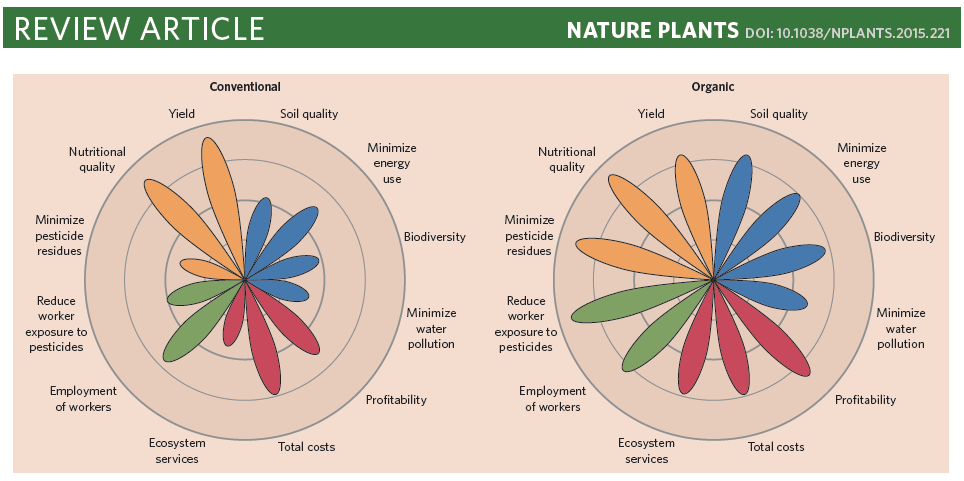

# Academic Citation
If you use this code in your work or research, we kindly request that you cite our publication:

Xiaofan Lu, et al. (2025). FigureYa: A Standardized Visualization Framework for Enhancing Biomedical Data Interpretation and Research Efficiency. iMetaMed. https://doi.org/10.1002/imm3.70005


```{r setup, include=FALSE}
knitr::opts_chunk$set(echo = TRUE)
```

## 需求描述
## Requirement description

用R代码画出paper里的图

Draw the figure in paper with R code



出自<https://www.nature.com/articles/nplants2015221>

from<https://www.nature.com/articles/nplants2015221>

## 使用场景
## Usage scenario

场景一：评估一个总体的不同组分的比例变化

场景二：评价同一衡量体系下的各项不同指标

Scenario 1: Evaluate the proportional changes of different components of a whole

Scenario 2: Evaluate different indicators under the same measurement system

## 环境设置
## Environment setting

```{r}
source("install_dependencies.R")


Sys.setenv(LANGUAGE = "en") #显示英文报错信息 display English error messages
options(stringsAsFactors = FALSE) #禁止chr转成factor prohibit the conversion of chr to factor

```

## 输入数据
## Input data

包含Name、ratio、fill、text_size、text_color的文件，用tab间隔

不用修改任何代码，直接准备好输入文件就ok了

输入文件的txt文本中，第一行即各列的名称，不能修改

File containing name, ratio, fill, text_size, text_color, separated by tabs

You don't have to change any code, just prepare the input file directly and it's fine.

In the txt text of the input file, the first line is the name of each column, which cannot be modified.

```{r}
mydata <- read.table("easy_input.txt", sep = "\t", header = T, stringsAsFactors = F, colClasses = c("character", "numeric", "character", "integer", "character"))
head(mydata)
```

## 开始画图
## Start drawing

画布将设置为21cm * 29.7cm（宽高）的A4纸

1cm = 35.43307px

The canvas will be set to 21cm * 29.7cm (width and height) A4 paper

1cm = 35.43307px

### 准备svg语句
### Prepare the svg statement

#### 1.画4个圆
#### 1.Draw 4 circles

svg圆语句格式为\<circle cx cy r style="stroke:#006600;fill:#00cc00"/\>，其中参数cx、cy定义原点坐标，r定义圆半径，style定义线颜色宽度类型填充等（其中，stroke定义线的颜色，stroke-width定义线的宽度，stroke-dasharray定义虚线，fill定义圆的填充颜色）

The SVG circle statement format is \<circle cx cy r style="stroke:#006600;fill:#00cc00"/\>, where the parameters cx and cy define the coordinates of the origin, r defines the radius of the circle, and style specifies the line color, width, type, fill, etc. (where stroke specifies the line color, stroke-width specifies the line width, stroke-dasharray specifies the dashed line, and fill specifies the fill color of the circle).
