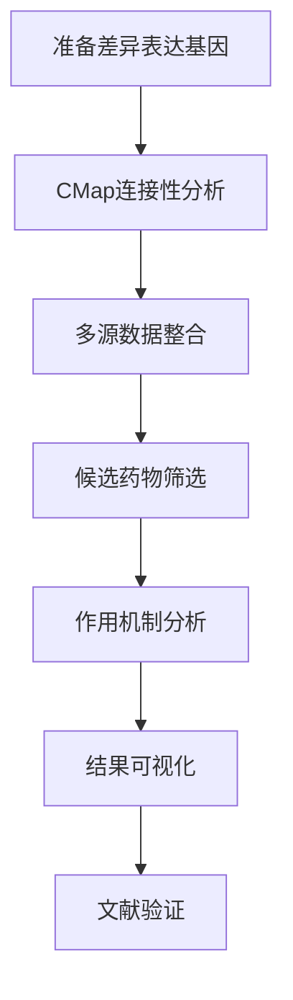

# FigureYa Agents功能文档索引 / Agents Functionality Documentation Index

欢迎使用FigureYa的**Agents功能**（治疗性药物分析功能）！本目录包含了完整的使用指南和教程。

Welcome to FigureYa's **Agents Functionality** (Therapeutic Agents Analysis)! This directory contains comprehensive guides and tutorials.

## 📚 文档结构 / Documentation Structure

### 🚀 新手入门 / Getting Started
- **[快速入门指南](Agents_Quick_Start.md)** - 5分钟了解Agents功能基础
- **[完整使用指南](Agents_Functionality_Guide.md)** - 详细的功能说明和最佳实践

### 💻 实践教程 / Hands-on Tutorials  
- **[教程示例脚本](Agents_Tutorial_Example.R)** - 可运行的R代码示例
- **[真实案例分析](#)** - 基于实际科研项目的案例（即将推出）

## 🎯 核心功能模块 / Core Functional Modules

| 模块名称 | 主要功能 | 文档链接 |
|---------|---------|---------|
| **FigureYa131CMap_update** | CMap连接性图谱分析 | [详细说明](../FigureYa131CMap_update/FigureYa131CMap_update.html) |
| **FigureYa213customizeHeatmap** | 多源证据药物筛选 | [详细说明](../FigureYa213customizeHeatmap/FigureYa213customizeHeatmap.html) |
| **FigureYa212drugTargetV2** | 药物靶点敏感性分析 | [详细说明](../FigureYa212drugTargetV2/FigureYa212drugTargetV2.html) |

## 🔧 使用流程 / Usage Workflow

## 📋 快速参考 / Quick Reference

### 核心概念 / Key Concepts
- **CMap (Connectivity Map)**: 基于基因表达模式的药物发现平台
- **富集得分 (Enrichment Score)**: 衡量药物与疾病基因表达模式相似性
- **MoA (Mechanism of Action)**: 药物作用机制分析
- **多源证据**: 整合PRISM、CTRP、CMap等多个数据库

### 常用数据库 / Common Databases
- [CLUE.io](https://clue.io/) - 新一代连接性图谱
- [CMap Build 02](https://portals.broadinstitute.org/cmap/) - 经典CMap数据库
- [GDSC](https://www.cancerrxgene.org/) - 基因组学药物敏感性数据库
- [CTRP](https://portals.broadinstitute.org/ctrp/) - 癌症治疗反应门户

## 🎓 学习路径建议 / Recommended Learning Path

### 初学者 / Beginners
1. 阅读 [快速入门指南](Agents_Quick_Start.md)
2. 运行 [教程示例脚本](Agents_Tutorial_Example.R)
3. 尝试使用自己的数据

### 进阶用户 / Advanced Users  
1. 深入学习 [完整使用指南](Agents_Functionality_Guide.md)
2. 探索不同模块的高级功能
3. 自定义分析流程和可视化

### 研究人员 / Researchers
1. 了解每个模块的科学原理
2. 学习如何整合多源数据
3. 掌握结果解读和验证方法

## 📊 典型应用场景 / Typical Applications

### 🔬 药物重定位 / Drug Repurposing
寻找现有药物的新适应症，加速药物开发进程。

### 🎯 精准医学 / Precision Medicine  
基于患者基因表达谱预测药物反应，实现个性化治疗。

### 🧬 机制研究 / Mechanism Studies
探索药物作用靶点和信号通路，深入理解药物作用机制。

### 📈 生物标志物发现 / Biomarker Discovery
识别预测药物敏感性的基因标志物。

## ❓ 常见问题 / FAQ

<strong>Q: 我应该使用CLUE.io还是CMap Build 02？</strong>

**A:** 
- **CLUE.io**: 数据更新，但基因数量限制较严格（最多300个基因）
- **CMap Build 02**: 数据较老但可上传更多基因（最多1000个基因）
- **建议**: 对于标准分析优先使用CLUE.io，需要大量基因时使用CMap Build 02

<strong>Q: 如何解读富集得分的正负值？</strong>

**A:**
- **负值**: 药物引起的基因表达变化与疾病**相反**，具有治疗潜力
- **正值**: 药物引起的基因表达变化与疾病**相似**，可能加重病情
- **绝对值大小**: 表示效应强度，|score| > 0.5通常认为是强效应

<strong>Q: 如何验证候选药物的可靠性？</strong>

**A:**
1. **文献检索**: 查询PubMed中的相关研究
2. **多数据库验证**: 在不同数据库中验证结果一致性  
3. **实验验证**: 进行细胞实验或动物实验
4. **临床数据**: 查询已有的临床试验结果

## 🤝 贡献和支持 / Contributing & Support

### 问题报告 / Issue Reporting
如果您在使用过程中遇到问题，请在[GitHub Issues](https://github.com/ying-ge/FigureYa/issues)中报告。

### 功能建议 / Feature Requests  
欢迎提出新功能建议和改进意见。

### 文档改进 / Documentation Improvement
如果您发现文档中的错误或需要补充的内容，欢迎提交Pull Request。

## 📝 更新日志 / Changelog

- **2025-01-16**: 创建Agents功能完整文档体系
- **2025-01-16**: 添加快速入门指南和教程示例
- **2025-01-16**: 完善使用流程和最佳实践

---

## 📞 联系我们 / Contact Us

- **GitHub**: [FigureYa Repository](https://github.com/ying-ge/FigureYa)
- **网站**: [FigureYa官方网站](https://ying-ge.github.io/FigureYa/)
- **邮箱**: 通过GitHub Issues联系

---
*文档维护: FigureYa开发团队 | 最后更新: 2025-01-16*